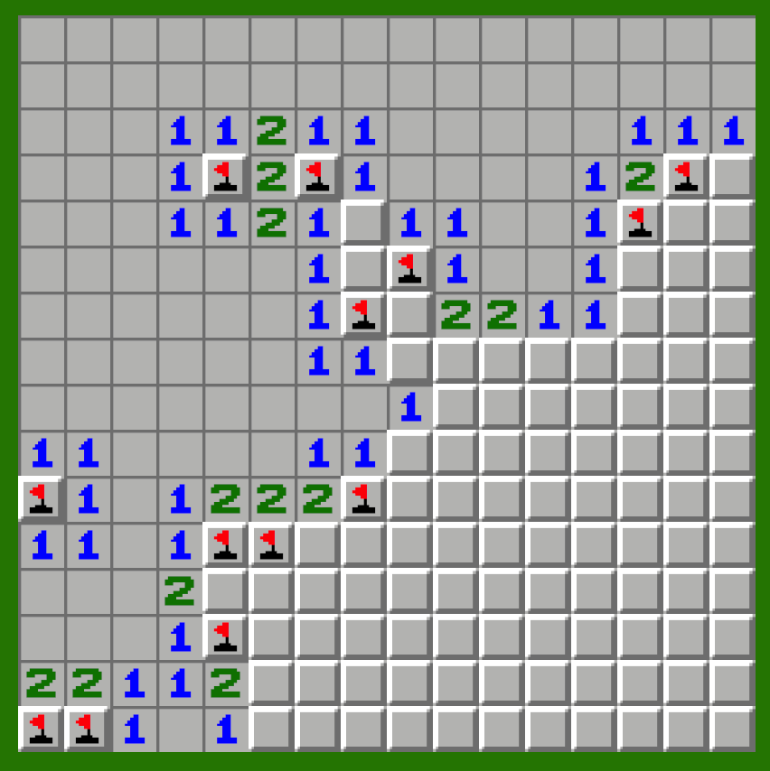

# MineSweeperClone

A Unity-based Minesweeper clone. The game uses a tilemap grid and classic Minesweeper rules to locate mines and reveal safe cells.

## Features

- Configurable grid size via `width`, `height`, and `mineCount` in the inspector.
- Random mine placement with collision handling.
- Flood-fill algorithm for opening empty cells.
- Reveals all mines when a mine is clicked.
- Flags all mines automatically when the player wins.
- Tilemap-based rendering.
- Input System support for left-click reveal, right-click flag, and `R` to restart.

## Project Structure

- `Assets/Scripts/Board`
  - `BoardGenerator.cs`: Generates the grid cells, mines, and adjacent numbers.
  - `BoardRenderer.cs`: Renders the grid to a Tilemap.

- `Assets/Scripts/Core`
  - `CellData.cs`: Stores the data for each cell.
  - `GridData.cs`: Handles cell access and boundary checks.
  - `CellType.cs`: Defines cell types (`Invalid`, `Mine`, `Number`, `Empty`).

- `Assets/Scripts/GamePlay`
  - `GameManager.cs`: Controls the game lifecycle and scene coordination.
  - `CellRevealer.cs`: Handles cell reveal, flood-fill, and explosion logic.
  - `WinConditionChecker.cs`: Checks win conditions and flags all mines on victory.

- `Assets/Scripts/Input`
  - `GameInputHandler.cs`: Reads mouse and keyboard input and converts it to grid coordinates.

- `Assets/Scripts/Events`
  - `GameEvents.cs`: Manages game events (`GameStarted`, `GameOver`, `GameWon`).

## How It Works

1. `GameManager` starts a new game with `NewGame()`.
2. `GridData` is created and all cells are initialized as `CellType.Empty`.
3. `BoardGenerator` places mines randomly.
4. Adjacent mine counts are calculated for non-mine cells.
5. `BoardRenderer` draws the grid to the Tilemap.
6. The player uses left click to reveal a cell and right click to toggle a flag.
7. Clicking a mine triggers `CellRevealer.Explode()` and ends the game.
8. `WinConditionChecker.HasWon()` verifies the win state when all safe cells are revealed.

## Controls

- Left click: Reveal cell
- Right click: Toggle flag
- `R`: Restart game
